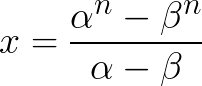
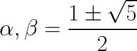

# Fibonacci

## What is this?

Since I was a little boy, I liked Fibonacci Sequence and I've done some silly researches about it. Here you can find most of it.

## What is Fibonacci Sequence?
In mathematics, the Fibonacci numbers or Fibonacci sequence are the numbers in the following integer sequence:

[Read about it here!](http://en.wikipedia.org/wiki/Fibonacci_number)

**Here is what a perfect Fibonacci software should do:**

+ You enter an `integer(n)` and it gives you `F(n)`.
+ You enter an `integer(n)` and it tells you whether it's a number in the Sequence or not.
+ You enter an `integer(n)` and it shows you all the numbers before `n`
+ You enter an `integer(n)` and it shows you all the numbers before `F(n)`

## Tips:
+ Instead of using `recursive algorithm` you should use this formula:

Where `n` is the `integer` and alpha/beta are:

